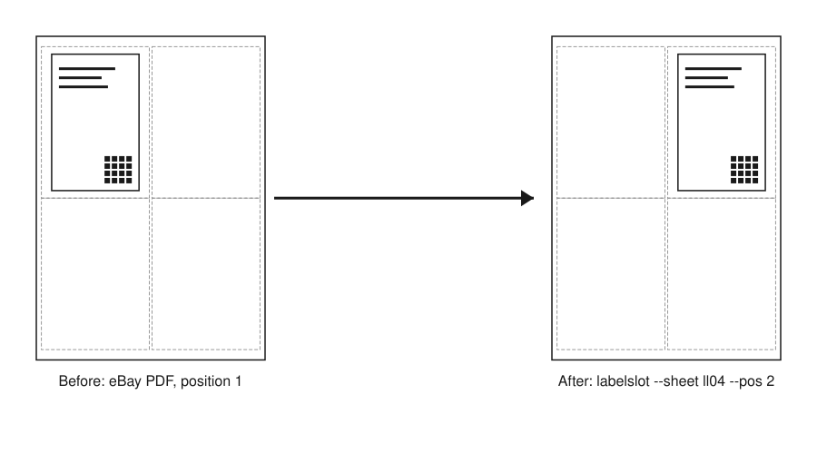

Put a shipping label PDF from eBay or Royal Mail Click & Drop at any position on an A4 label sheet, or on a 4x6 thermal label, without scaling it.

# labelslot



Before: the eBay PDF draws the label where position 1 of a 4-per-sheet A4 sheet would be. After: labelslot moves the same label, unscaled, to position 2, so the rest of a part-used sheet isn't wasted.

## Why this exists

eBay draws the label at the top left of an A4 page and has no position setting, so on a 4-per-sheet label sheet you can only ever print on position 1. Royal Mail Click & Drop lets personal customers choose a label position, so use that if you can. labelslot is for the cases you can't fix at the source, and for printing the same label on a 4x6 thermal printer.

## Install

There are three ways to run it. All of them do the same job, and none of them uploads your label anywhere.

### Web version (no install)

Open [gm5dna.github.io/labelslot](https://gm5dna.github.io/labelslot/). It runs entirely in your browser.

### Desktop app

Download from the [Releases page](https://github.com/gm5dna/labelslot/releases):

- **macOS:** open the `.dmg` and drag labelslot to Applications. The app isn't signed yet, so the first time you open it macOS will say it can't check it for malware. Click Done, then go to **System Settings → Privacy & Security**, scroll down to the message about labelslot, and click **Open Anyway**. You only need to do this once.
- **Windows:** run the `-setup.exe` installer. The installer isn't code-signed, so SmartScreen will warn you: click **More info**, then **Run anyway**.
- **Linux:** use the `.deb`, or the `.AppImage` after `chmod +x labelslot_*.AppImage`.

The desktop app saves its PDFs to your Downloads folder, and replaces any existing file with the same name.

### Command line

This needs [Node 24 or later](https://nodejs.org). On macOS, `brew install node` installs it.

```
npx labelslot --help
```

or install it once:

```
npm install -g labelslot
```

## Quick start (60 seconds)

### Web version or desktop app

1. Choose your label sheet under **Target**, for example `ll04` for Avery L7169 / Label Planet LP4/99.
2. Click the position you want on the sheet picture. labelslot remembers which positions you have already used on the current sheet and moves to the next free one.
3. Drop your label PDF anywhere on the window, or click **Add PDFs…**.
4. Click **Make PDF** and check the preview. The dashed outlines show the label edges.
5. Click **Download PDF**, then print it at **100% / Actual size**.

Positions are marked as used when you download, not when you make the preview. That way you can change the settings and press Make PDF again without losing a label. If you peel off labels by hand, or load a fresh sheet, tick or untick the positions under the sheet picture, or click **Reset sheet**.

### Command line

```
labelslot --sheet ll04 --pos 2 label.pdf -o out.pdf
labelslot --target 6x4 label.pdf -o out.pdf
```

The first command puts `label.pdf` on position 2 of an `ll04` A4 sheet. The second centres it on a 4x6 in thermal label (`--target` means the same as `--sheet`). `labelslot --list-sheets` lists the sheet ids.

Give it several PDFs, or a PDF with several pages, and the labels fill the following positions in order. When a sheet is full, the next label starts a new page:

```
labelslot --sheet ll04 --pos 2 order1.pdf order2.pdf order3.pdf -o out.pdf
```

## Supported sheets

| id | label size | per sheet | vendor names |
|---|---|---|---|
| `ll04` | 99.1 x 139 mm | 4 (A4) | Label Planet LP4/99, Avery L7169 |
| `lp4-105` | 105 x 148.5 mm | 4 (A4) | Label Planet LP4/105 |
| `l7168` | 199.6 x 143.5 mm | 2 (A4) | Avery L7168, Label Planet LP2/199 |
| `6x4` | 101.6 x 152.4 mm | 1 (thermal) | 4 x 6 in thermal label |

On the command line, `--sheets file.json` replaces this list with your own definitions. See Contributing for the file format.

## Calibration

Printers feed paper slightly off, and label sheets are cut to within a millimetre or two, so a small correction per printer is normal. Work it out once:

1. Print a calibration page at 100%. In the app, click **Calibration page…**. On the command line, run `labelslot calibrate --sheet ll04 -o test.pdf`.
2. Each label corner gets a crosshair and a millimetre ruler. Compare where the crosshairs print with the real label corners.
3. If a crosshair prints to the right of the corner, enter that distance as a negative X nudge. If it prints below the corner, enter it as a negative Y nudge. (+X moves the label right, +Y moves it down.)

In the app, type a printer name. The nudge is saved under that name and comes back whenever you pick that printer again. On the command line, add `--nudge X,Y` (in mm) to each run.

## Printing

> **Print sheet output at 100% / "Actual size", never "Fit to page".** Many print dialogs default to fitting the page, which rescales the label and moves it off the label position.
>
> **For thermal output, turn off the driver's "scale to fit media" option.** The PDF page is already exactly 4 x 6 in. Zebra, Rollo, Dymo and similar drivers will otherwise resize it again.

## Privacy

Everything runs on your own computer, or in your own browser for the web version. Your label PDF, which contains your customer's name and address, is never uploaded, and labelslot has no network code. The source is open, so you can check this yourself.

## FAQ

**Can I print an eBay label on the second label of a 4 per sheet A4 sheet?**
Yes. Choose `ll04` and click position 2 in the app, or run `labelslot --sheet ll04 --pos 2 label.pdf -o out.pdf`.

**Can I print an eBay label on a 4x6 thermal printer?**
Yes. Choose `6x4` in the app, or run `labelslot --target 6x4 label.pdf -o out.pdf`. Turn off "scale to fit media" in the printer driver first. If the label only fits sideways, labelslot turns the whole page by 90 degrees and says so.

**It says my page is an integrated label and despatch note. What do I do?**

> The drawn content on this page covers half the page or more, so it is almost certainly a Royal Mail Click & Drop integrated label plus despatch note, not a bare label. labelslot cannot place it on a label. In Click & Drop, change your label format from the integrated label to the separate-label (label only) template, download the label again, and retry.

labelslot can't cut the label out of an integrated PDF. Download the label-only version from Click & Drop instead.

**Why does it say detection failed, or that the label is too large?**
labelslot finds the label by measuring where the ink is on the page. Stray marks near the label, a scanned page or an unusual PDF can make the measurement bigger than the label really is. Set **Assume position** in the app (`--assume-position N` on the command line) to skip measuring. labelslot then treats the label as sitting where position N of the chosen sheet would be; for an eBay label that is usually 1. On the command line you can also try a different measuring resolution with `--dpi N`.

**Why won't it scale my label to fit?**
Shrinking the label also shrinks its barcode and datamatrix, and a 203 dpi thermal print head can only print a datamatrix module so small before it stops scanning. **Allow scale** (`--allow-scale`) is there for edge cases. It tells you the scale factor it used, and a shrunk label that looks fine on screen may still fail to scan once printed.

**The label prints a few mm off.**
Follow the steps under Calibration, and check that you printed at 100%.

**Does it change the barcode?**
No. The label's drawing instructions are copied into the output byte for byte. Nothing is redrawn, rasterised or rescaled, and the test suite checks exactly that, not just that the output looks right.

**Does it work with Letter-size sheets?**
Not yet. Every sheet definition needs margins taken from the vendor's own template, and no Letter template has been added yet. Contributions are welcome.

## Not affiliated

labelslot is not affiliated with eBay, Royal Mail, Avery or Label Planet.

## Contributing

The most useful contribution is a new sheet definition. In `sheets.json`, copy an existing entry and change it:

- all sizes, margins and gaps in mm
- positions numbered left to right, top to bottom
- `source` must cite the vendor's own template page, with its URL, for the margins and gaps you used

Then run `npm test` and open a pull request. `npm run lint` type-checks the project. MIT licence (see `LICENSE`).
